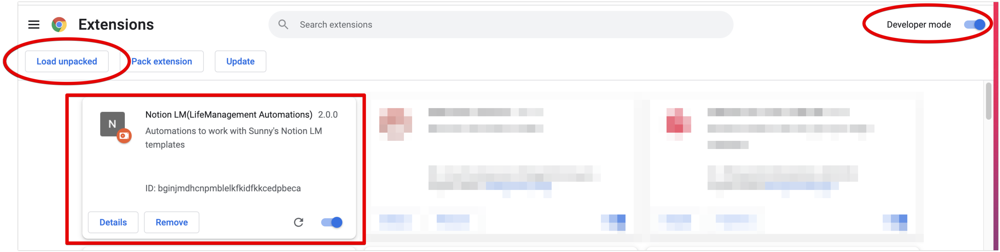
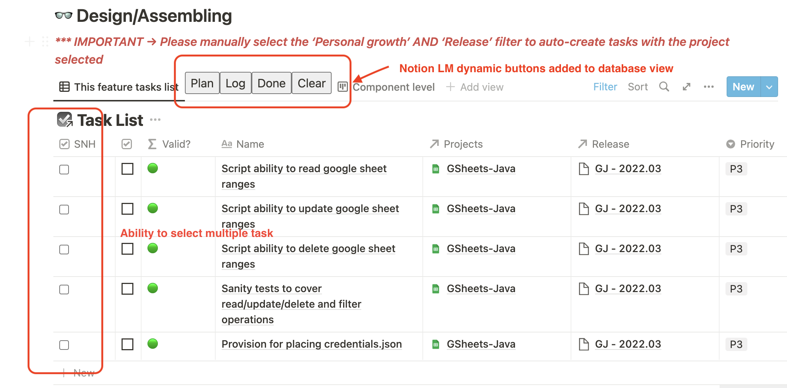
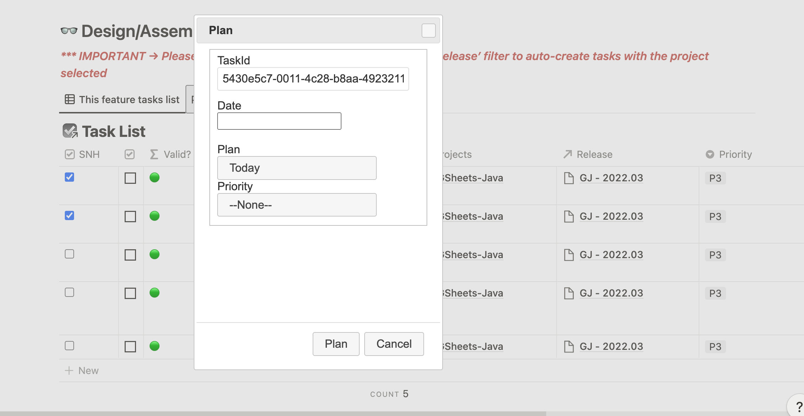
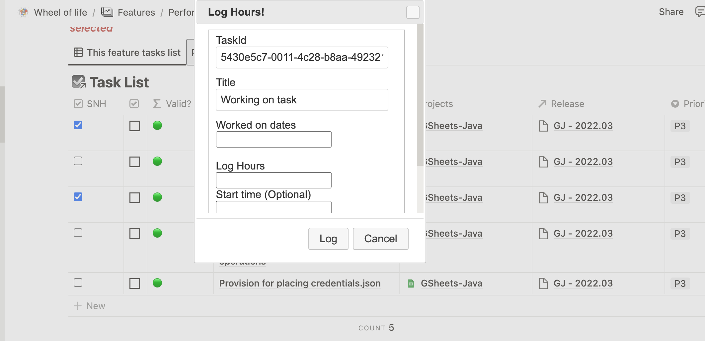
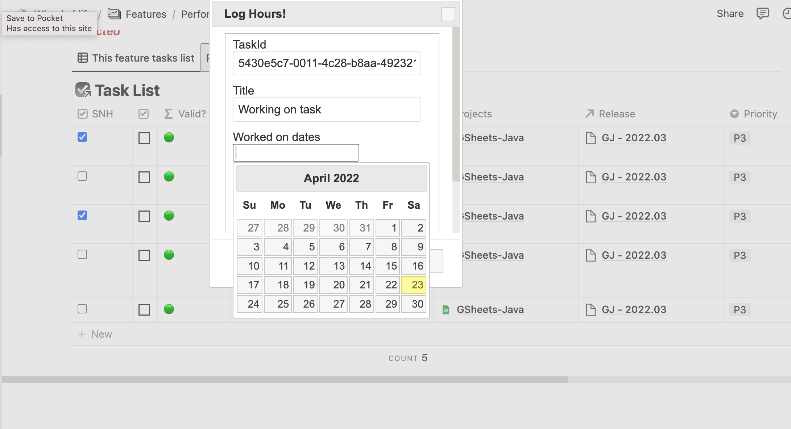
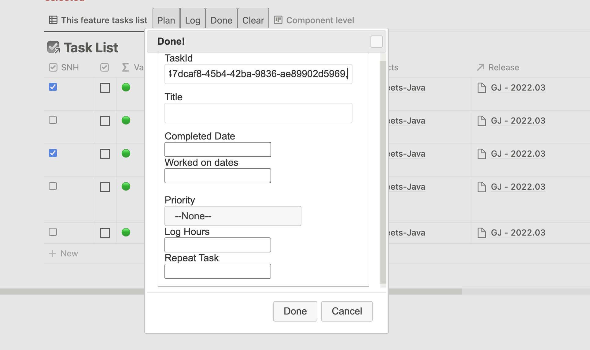

# notion-lm-crx
A chrome extension which works with [notion-lm-api](https://github.com/sunnydsouza/notion-lm-api) to achieve automation in Notion workspace.
**PLEASE NOTE** - this doesnt work standalone and **WILL NEED** the [notion-lm-api](https://github.com/sunnydsouza/notion-lm-api) to be deployed on a suitable environment.

### Tools used ###
* HTML, CSS and JavaScript

This is a chrome extension which works alongside the Notion LM Api (designed in Python Flask). There is also a version of this which works as a tampermonkey script.

### Installation instructions

Go to the release section to download a release as zip

```java
https://github.com/sunnydsouza/notion-lm-crx/releases/
```

Else, simply clone the project in a local directory

```java
git clone https://github.com/sunnydsouza/notion-lm-crx.git
```

**IMPORTANT NOTE FOR V1**
In case you are using V1, then you need to manually specify the endpoint where [notion-lm-api](https://github.com/sunnydsouza/notion-lm-api) is deployed in the `content.bundle.js` file

```java
// Change the below url based on where you deploy notion-lm-api
let API_URL="https://192.168.0.128:8200"; 
```


Once downloaded to.a local directory, open the chrom extensions menu and enable **developer mode**

Select the `Load unpacked` options and then select the directory where you cloned the project.

On successful load, you should be able to see the extension loaded as below 🥳



### *What does the extension do?*

Basically, the extension dynamically adds  options (in form of buttons) on feature task pages/ Idea task list/ GTD pages sub tasks pages. The extension is basically to help manage tasks by providing the below options

- Ability to perform operations on multiple tasks together
- Marking task/tasks done(which automatically adds the completed date/week/month/year properties)
- Log hours against task/tasks or mark them completed together
- Plan task/tasks to a date/month/week
- Auto add filters to feature task page, so that when tasks are added to the filtered database, most mandatory fields/properties are already filled in

### Options dynamically added on feature page, when the extension is active



## Plan

Ability to select multiple tasks and plan them on day/week/month

Ability to priortize tasks



## Log Hours

Ability to log hours against single or multiple tasks at once. 

If multiple tasks are selected and multiple dates are selected in “Worked on dates”, then in that case, the hours are **equally** distributed across multiple tasks and dates

eg: if 2 tasks are selected and you have worked on both for 2 days, and the hours logged in “Log Hours” field is 10, then hours logged across each task would be 10/2*2=2.5/each day




## Mark task/tasks as ‘Done’

You can *ONLY* put in one “Completed Date” (obvious) but can select multiple “Worked on dates”, as you could have worked on the tasks for say, a week or so.

The principle of logged hours remains same here - if 2 tasks are selected and you have worked on both for 2 days, and the hours logged in “Log Hours” field is 10, then hours logged across each task would be 10/2*2=2.5/each day




Author [Sunny Dsouza](https://sunnydsouza.com)
